# Final Visual Review Index

This index is for ChatGPT/user visual inspection. It does not claim human visual approval.

## Status

- Automated Check Result: `PASS`
- Visual Review Result: `PENDING_REVIEW`
- Human Approval Status: `NOT_APPROVED_YET`
- Final PNG: `hardware/eda/exports/final/esp32_temperature_control_unit_electrical_schematic.png`
- Final PDF: `hardware/eda/exports/final/esp32_temperature_control_unit_electrical_schematic.pdf`

## Review Images

### overview

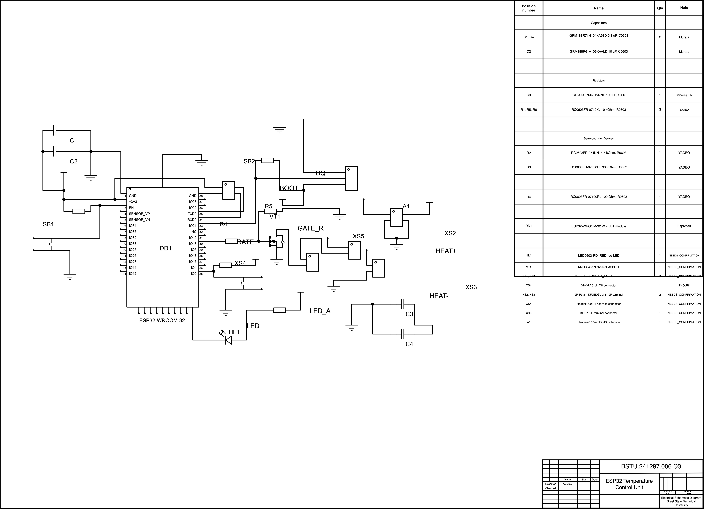

- Review purpose: Whole-sheet visual review: frame, title block, element list, JLC-style schematic block placement, and overall balance.
- Focus: Check that nothing is cropped, no UI artifacts exist, and the JLC-style schematic block does not overlap the tables.
- Related refs: `DD1, VT1, HL1, SB1, SB2, A1, XS1, XS2, XS3, XS4, XS5, R1, R2, R3, R4, R5, R6, C1, C2, C3, C4`
- Related nets: `+3V3, +12V, GND, EN, DQ, RXD0, TXD0, BOOT, GATE, GATE_R, HEAT+, HEAT-`
- Current automated status: `PASS`
- Source PNG: `hardware/eda/exports/final/esp32_temperature_control_unit_electrical_schematic.png`
- Pixel box: `{'x': 0, 'y': 0, 'width': 6431, 'height': 4654}`

### jlc_style_block

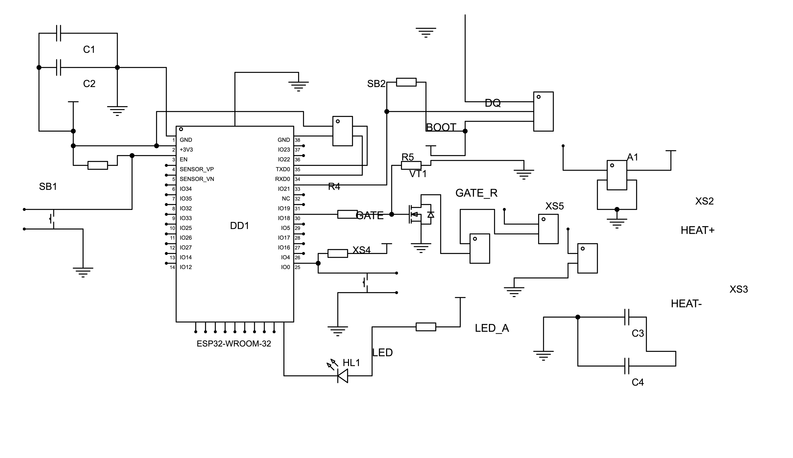

- Review purpose: JLC-style middle schematic review.
- Focus: Check that the middle circuit keeps the original JLC symbol style while using school refs and canonical net names.
- Related refs: `DD1, VT1, HL1, SB1, SB2, A1, XS1, XS2, XS3, XS4, XS5, R1, R2, R3, R4, R5, R6, C1, C2, C3, C4`
- Related nets: `+3V3, +12V, GND, EN, DQ, RXD0, TXD0, BOOT, GATE, GATE_R, HEAT+, HEAT-`
- Current automated status: `PASS`
- Source PNG: `hardware/eda/exports/final/esp32_temperature_control_unit_electrical_schematic.png`
- Pixel box: `{'x': 173, 'y': 1007, 'width': 4434, 'height': 2563}`

### dd1_area

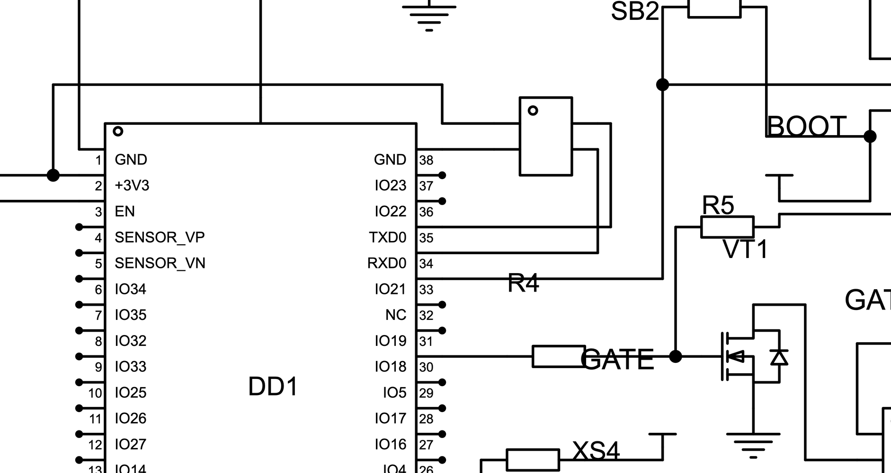

- Review purpose: ESP32 controller area review.
- Focus: Check DD1 pin labels, net labels, local wire endpoints, and text clearance.
- Related refs: `DD1`
- Related nets: `+3V3, GND, EN, LED, BOOT, GATE, DQ, RXD0, TXD0`
- Current automated status: `PASS`
- Source PNG: `hardware/eda/exports/final/esp32_temperature_control_unit_electrical_schematic.png`
- Pixel box: `{'x': 936, 'y': 1452, 'width': 1882, 'height': 1001}`

### reset_boot_led_area

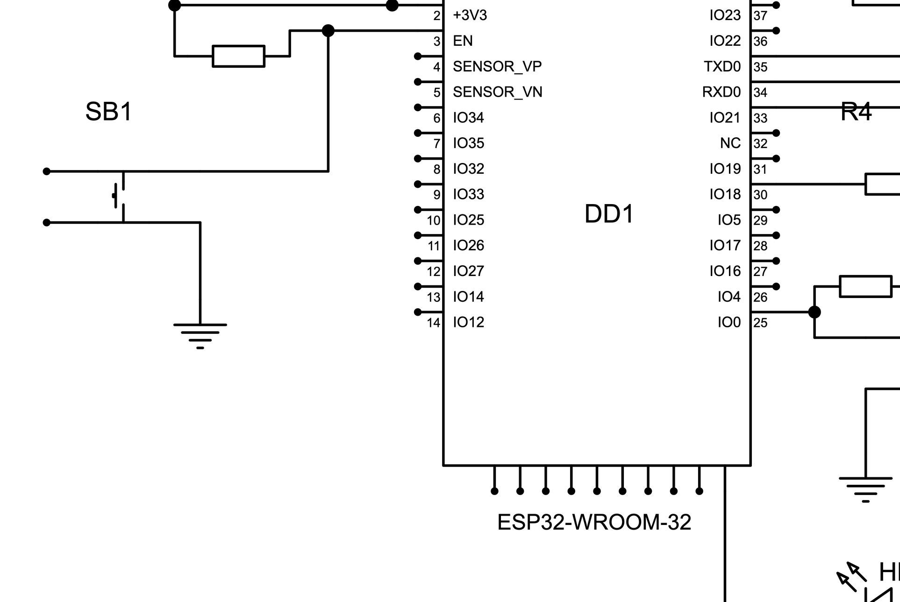

- Review purpose: Reset, boot, and LED blocks review.
- Focus: Check local wire continuity and that symbols/text are not crowded.
- Related refs: `R1, SB1, R6, SB2, R3, HL1`
- Related nets: `+3V3, GND, EN, BOOT, LED, LED_A`
- Current automated status: `PASS`
- Source PNG: `hardware/eda/exports/final/esp32_temperature_control_unit_electrical_schematic.png`
- Pixel box: `{'x': 209, 'y': 1812, 'width': 1926, 'height': 1289}`

### sensor_uart_area

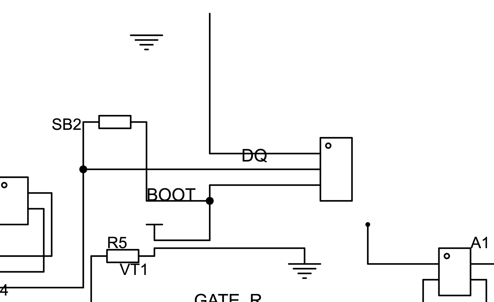

- Review purpose: Sensor and UART/service connector review.
- Focus: Check connector labels, pull-up wiring, and UART net visibility.
- Related refs: `R2, XS1, XS4`
- Related nets: `DQ, +3V3, GND, RXD0, TXD0`
- Current automated status: `PASS`
- Source PNG: `hardware/eda/exports/final/esp32_temperature_control_unit_electrical_schematic.png`
- Pixel box: `{'x': 2047, 'y': 1043, 'width': 1712, 'height': 1049}`

### heater_power_area

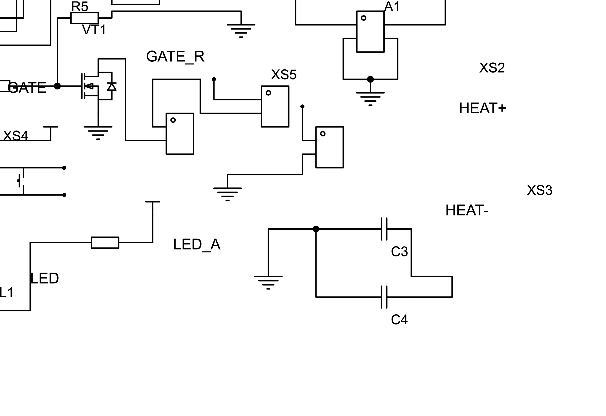

- Review purpose: Heater driver and power area review.
- Focus: Check MOSFET gate network, heater connector, thermal switch, and power conversion wiring.
- Related refs: `R4, R5, VT1, XS2, XS5, XS3, A1, C3, C4`
- Related nets: `GATE, GATE_R, HEAT+, HEAT-, +12V, +3V3, GND`
- Current automated status: `PASS`
- Source PNG: `hardware/eda/exports/final/esp32_temperature_control_unit_electrical_schematic.png`
- Pixel box: `{'x': 2132, 'y': 1860, 'width': 2439, 'height': 1674}`

### power_area

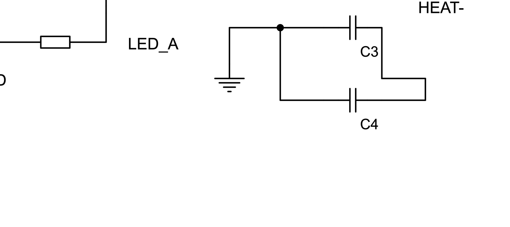

- Review purpose: Power input and DC/DC converter review.
- Focus: Check input/output power labels and capacitor placement.
- Related refs: `XS3, A1, C3, C4`
- Related nets: `+12V, +3V3, GND`
- Current automated status: `PASS`
- Source PNG: `hardware/eda/exports/final/esp32_temperature_control_unit_electrical_schematic.png`
- Pixel box: `{'x': 2346, 'y': 2677, 'width': 1925, 'height': 857}`

### element_list_full

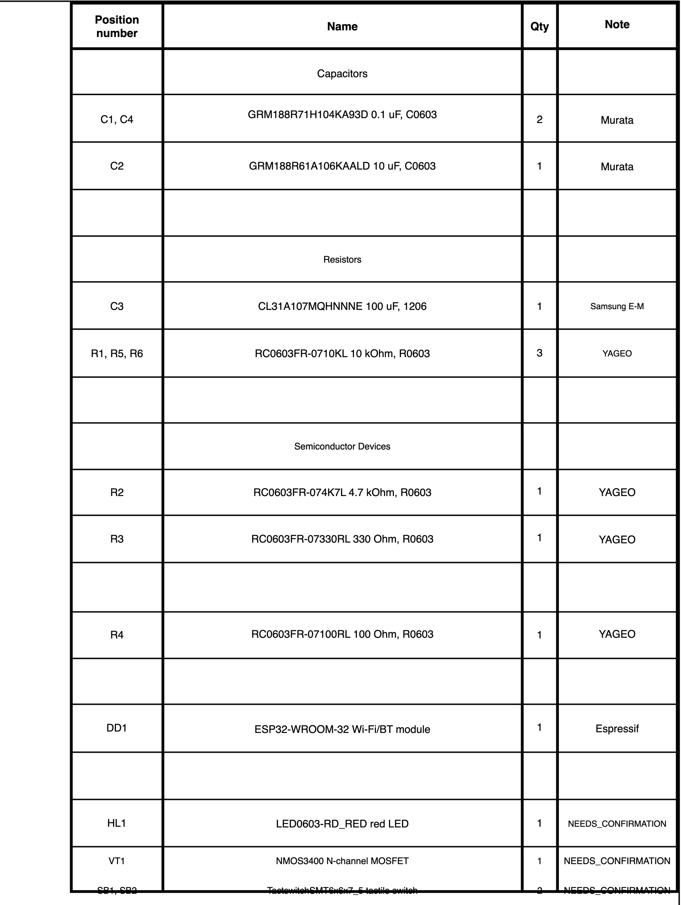

- Review purpose: Right-top List of Elements full-table review.
- Focus: Check text readability, row alignment, line weight consistency, and locked master geometry.
- Related refs: `DD1, VT1, HL1, SB1, SB2, A1, XS1, XS2, XS3, XS4, XS5, R1, R2, R3, R4, R5, R6, C1, C2, C3, C4`
- Related nets: ``
- Current automated status: `PASS`
- Source PNG: `hardware/eda/exports/final/esp32_temperature_control_unit_electrical_schematic.png`
- Pixel box: `{'x': 4498, 'y': 0, 'width': 1933, 'height': 2567}`

### element_list_top

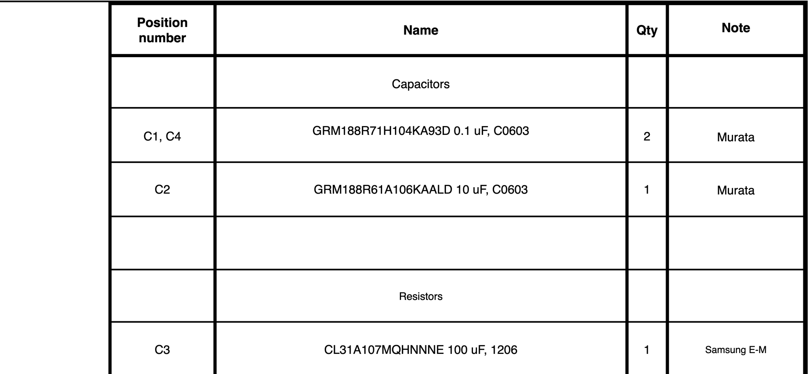

- Review purpose: Top part of List of Elements review.
- Focus: Check capacitor/resistor rows and table header alignment.
- Related refs: `C1, C2, C3, C4, R1, R2, R3, R4, R5, R6`
- Related nets: ``
- Current automated status: `PASS`
- Source PNG: `hardware/eda/exports/final/esp32_temperature_control_unit_electrical_schematic.png`
- Pixel box: `{'x': 4428, 'y': 0, 'width': 2003, 'height': 929}`

### element_list_middle

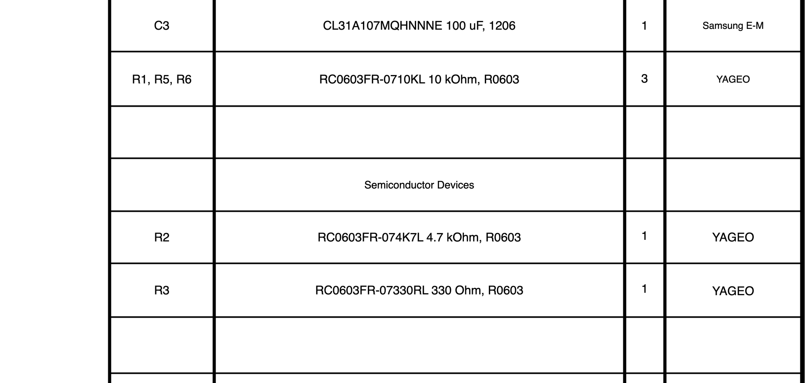

- Review purpose: Middle part of List of Elements review.
- Focus: Check semiconductor, switch, and connector rows.
- Related refs: `DD1, HL1, VT1, SB1, SB2, XS1, XS2, XS3`
- Related nets: ``
- Current automated status: `PASS`
- Source PNG: `hardware/eda/exports/final/esp32_temperature_control_unit_electrical_schematic.png`
- Pixel box: `{'x': 4428, 'y': 805, 'width': 2003, 'height': 955}`

### element_list_bottom

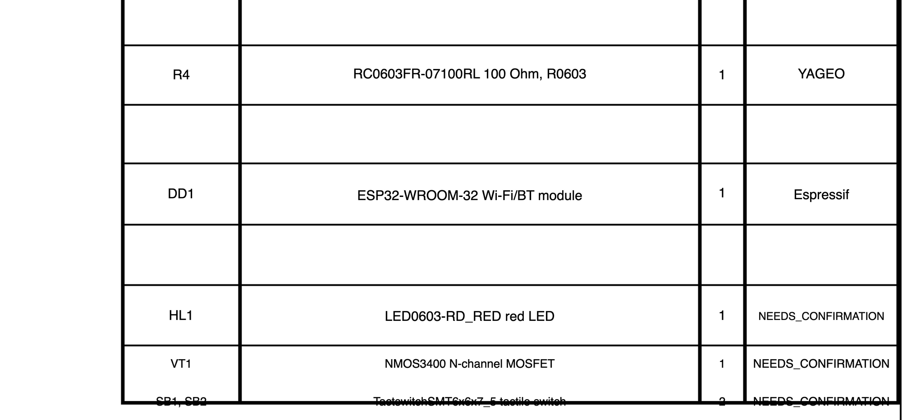

- Review purpose: Bottom part of List of Elements review.
- Focus: Check service connector, thermal switch terminal, and power module rows.
- Related refs: `XS4, XS5, A1`
- Related nets: ``
- Current automated status: `PASS`
- Source PNG: `hardware/eda/exports/final/esp32_temperature_control_unit_electrical_schematic.png`
- Pixel box: `{'x': 4428, 'y': 1635, 'width': 2003, 'height': 932}`

### title_block_full

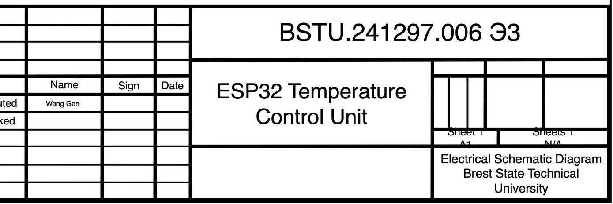

- Review purpose: Right-bottom Title Block review.
- Focus: Check document code, title text, organization, format, sheet fields, and master geometry.
- Related refs: ``
- Related nets: ``
- Current automated status: `PASS`
- Source PNG: `hardware/eda/exports/final/esp32_temperature_control_unit_electrical_schematic.png`
- Pixel box: `{'x': 5042, 'y': 4190, 'width': 1389, 'height': 464}`

## Finding Crops

No warning/blocker finding crops are present in the current layout audit.

